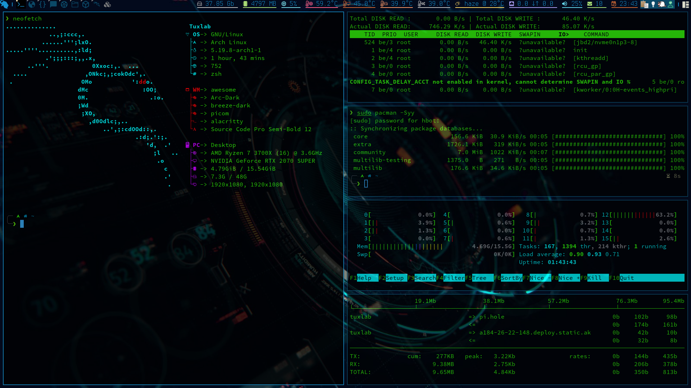
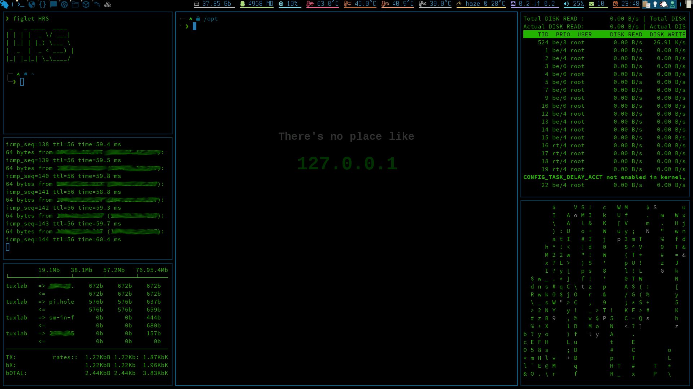
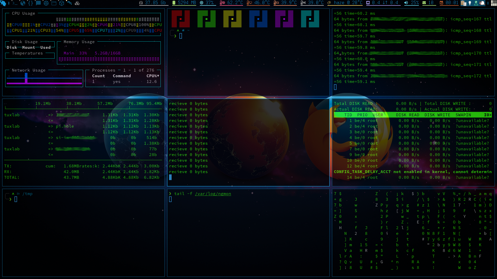

<div align="center">
    <h1>dotfiles</h1>
    <p>There's no place like <b><code>~</code></b> !</p>
    <p>
    
    </p>
</div>

## Table of Contents

+ [Screenshots](#screenshots)
+ [Introduction](#introduction)
+ [Setup Repository](#setup-repository)
+ [Track Files](#track-files)
+ [Restore Configurations](#restore-configurations)

## Screenshots





## Introduction

This repository contains my personal configuration files (also known as
*dotfiles*).

In the following sections I'll explain how this dotfiles repository was set up,
how to use it and how to restore them, for example on a new device.


## Setup Repository

Setup a bare git repository in your home directory. Bare repositories have no
working directory, so setup an alias to avoid typing the long command. 
Hide untracked files when querying the status. Add the git directory `~/.dotfiles/`
to the gitignore as a security measure. Setup remote and push. 

```bash
git init --bare "$HOME/.dotfiles"

echo 'alias dotfiles="/usr/bin/env git --git-dir=$HOME/.dotfiles/ --work-tree=$HOME"' \
    >> "$HOME/.zshrc"
source "$HOME/.zshrc"

dotfiles config --local status.showUntrackedFiles no

echo '.dotfiles' >> "$HOME/.gitignore"
dotfiles add "$HOME/.gitignore"
dotfiles commit -m 'Git: Add gitignore'

dotfiles remote add origin git@github.com:hrshadhin/dotfiles.git
dotfiles push --set-upstream origin master
```

## Track Files

Use the default git subcommands to track, update and remove files. You can
obviously also use branches and all other features of git.

```bash
dotfiles status
dotfiles add .zshrc
dotfiles commit -m 'Zsh: Add zshrc'
dotfiles add .vimrc
dotfiles commit -m 'Vim: Add vimrc'
dotfiles push
```

To remove a file from the repository while keeping it locally you can use:

```bash
dotfiles rm --cached ~/.some_file
```

## Restore Configurations

First clone dependent repositories, in this case for example `oh-my-zsh` and `powerline10k`.
Clone your dotfiles repository as bare repository. Setup alias and hide untracked files when querying the status. Then checkout and update all submodules.

```bash
# install oh-my-zsh
sh -c "$(curl -fsSL https://raw.githubusercontent.com/ohmyzsh/ohmyzsh/master/tools/install.sh)"

# powerline10k theme
git clone --depth=1 https://github.com/romkatv/powerlevel10k.git ~/powerlevel10k

# install Patched Nerd Fonts(study below links)
# - https://github.com/adobe-fonts/source-code-pro
# - https://github.com/ryanoasis/nerd-fonts


# clone dotfiles
git clone --bare --recursive https://github.com:hrshadhin/dotfiles \
    "$HOME/.dotfiles"

echo 'alias dotfiles="/usr/bin/env git --git-dir=$HOME/.dotfiles/ --work-tree=$HOME"' \
    >> "$HOME/.zshrc"
source "$HOME/.zshrc"

dotfiles config --local status.showUntrackedFiles no

dotfiles checkout

## Note that if you already have some of the files you'll get an error message. You can either (1) delete them or (2) back them up somewhere else. It's up to you.

dotfiles submodule update --recursive --remote
```

__Warning__ This is for my personal use. Instead of directly sourcing the install
script, you should save it somewhere on your system and review it.
